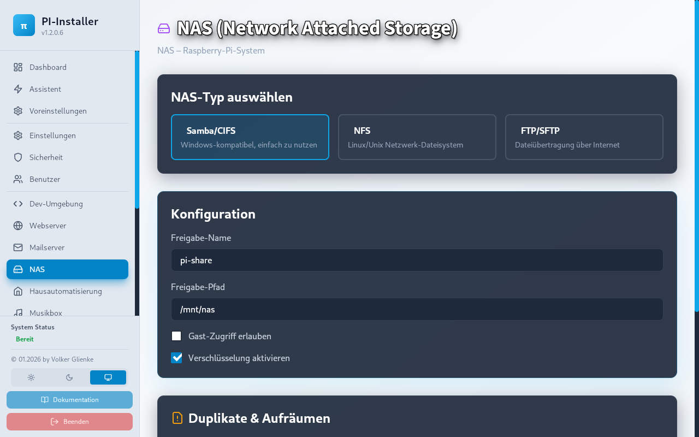
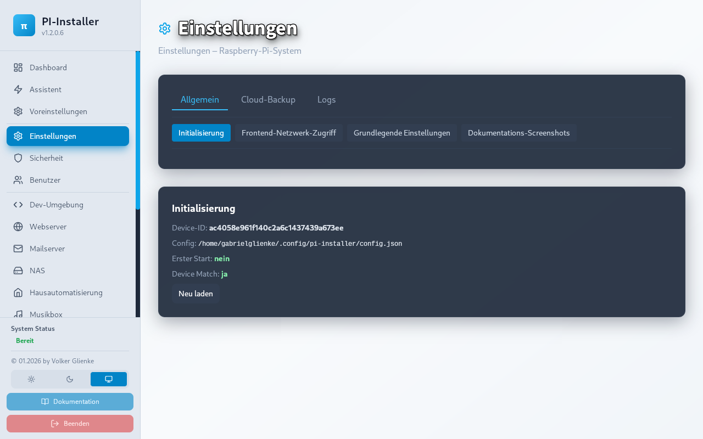

# PI-Installer - Raspberry Pi Konfigurations-Assistent 🥧

Ein umfassendes, **benutzerfreundliches System** zur automatisierten Konfiguration und Härtung eines Raspberry Pi mit moderner Web-GUI. Von der Grundkonfiguration direkt zum produktiven System!

**Neu ab 1.3.1.0:** App Store mit 7 Apps, Erste-Schritte-Assistent, Dashboard „Dein Pi läuft!“, Mobile-Navigation (Hamburger-Menü), kontextsensitive Hilfe, One-Click-Installer, Laufwerk klonen (Backup & Restore), DSI-Radio (Freenove TFT) mit Lautstärke- und Anzeige-Steuerung.

## 🎯 Kernfeatures

### 1. **Sicherheit & Härtung** 🔒
- Automatische Sicherheitsupdates
- Firewall-Konfiguration (UFW)
- SSH-Hardening
- Fail2Ban Installation
- SSL/TLS Zertifikate
- Port-Management
- System-Audit Logging

### 2. **Benutzerverwaltung** 👥
- Neue Benutzer erstellen
- Rollenbasierte Zugriffe (Admin, Developer, User)
- sudo-Konfiguration
- SSH-Key Management
- Passwort-Policies

### 3. **Entwicklungsumgebung** 💻
- Python/Node.js/Go Installation
- Git & GitHub Integration
- VSCode Server / Cursor AI
- Docker & Docker-Compose
- Datenbanken:
  - PostgreSQL
  - MySQL/MariaDB
  - MongoDB
  - Redis
- Package Managers vorkonfiguriert

### 4. **Webserver-Setup** 🌐
- Nginx/Apache Auto-Configuration
- PHP/Python WSGI Support
- SSL Let's Encrypt
- Reverse-Proxy Setup
- CMS-Installation (WordPress, Drupal, Nextcloud)
- Webadmin Panels (Cockpit, Webmin)

### 5. **Mailserver** 📧
- Postfix + Dovecot
- Spam-Filter (SpamAssassin)
- Backup-Konfiguration

### 6. **Backup & Monitoring** 📊
- Automatische Backups
- System-Monitoring (Prometheus)
- Log-Aggregation
- Performance-Dashboard

## 📋 Systemanforderungen

- Raspberry Pi 4 oder besser
- Raspberry Pi OS (Debian-basiert)
- 4GB+ RAM
- 32GB+ Storage
- Internetzugang

## 🚀 Schnellstart

### One-Click Installation (empfohlen)

Ein Befehl – Installation inkl. Python/Node-Prüfung, Backend/Frontend-Setup und systemd-Service:

```bash
curl -sSL https://raw.githubusercontent.com/IHR-USERNAME/PI-Installer/main/scripts/create_installer.sh | bash
```

**Hinweis:** Ersetzen Sie `IHR-USERNAME` durch Ihren GitHub-Benutzernamen bzw. den Repository-Besitzer.  
Wenn die Domain **get.pi-installer.io** eingerichtet ist, lautet der Befehl:

```bash
curl -sSL https://get.pi-installer.io | bash
```

Am Ende erscheint die Adresse zum Öffnen (z. B. `http://<IP>:3001` oder `http://pi-installer.local:3001`). Der Dienst startet automatisch und nach jedem Neustart.

---

### Manueller Schnellstart (3 Schritte)

### Python: 3.9 oder neuer (3.12 empfohlen)

```bash
python3 --version  # Sollte 3.9–3.12 sein
```

Siehe **PYTHON_SETUP.md** bei Problemen oder für Python 3.13.

### 1️⃣ Repository klonen & Backend starten
```bash
cd ~
git clone https://github.com/yourusername/PI-Installer.git
cd PI-Installer/backend

# Virtuelle Umgebung (Python 3.9+)
python3 -m venv venv
source venv/bin/activate

# Dependencies installieren
pip install --upgrade pip
pip install -r requirements.txt

# Server starten (Port 8000)
python3 app.py
```

### 2️⃣ Frontend starten (neues Terminal)
```bash
cd PI-Installer/frontend

npm install
npm run dev
```

### 3️⃣ Browser öffnen
```
http://localhost:3001
```

## 📚 Dokumentation

- **[INSTALL.md](./INSTALL.md)** - Detaillierte Installationsanleitung (inkl. Troubleshooting Mixer)
- **[ARCHITECTURE.md](./ARCHITECTURE.md)** - System-Architektur & Design
- **[FEATURES.md](./FEATURES.md)** - Alle Features & Roadmap
- **[CHANGELOG.md](./CHANGELOG.md)** - Versions-Changelog (1.2.0.0, 1.0.4.0, …)
- **[VERSIONING.md](./VERSIONING.md)** - Versionsschema, wann Version erhöht wird, Changelog-Führung
- **[SUGGESTIONS.md](./SUGGESTIONS.md)** - Erweiterte Vorschläge & Best Practices

## 🎨 GUI-Highlights

### Screenshots

| Dashboard | Assistent | Sicherheit |
|:---:|:---:|:---:|
|  |  |  |

| NAS | Control Center | Einstellungen |
|:---:|:---:|:---:|
|  |  |  |

### Moderne, responsive Web-Oberfläche
- **Dark Mode** mit Sky-Blue Accents
- **Glasmorphism Design** für elegante Ästhetik
- **Echtzeit Updates** mit WebSocket-Support
- **Mobile-freundlich** auf allen Geräten
- **Accessibility Features** (WCAG 2.1)

### Benutzerführung
1. **Dashboard** - Systemübersicht mit Live-Daten
2. **Installationsassistent** - 6-Schritt-Wizard
3. **Modul-Pages** - Detaillierte Konfiguration
4. **Status-Übersicht** - Echtzeit-Monitoring

## 🏗️ Projektstruktur

```
PI-Installer/
├── backend/                 # Python/FastAPI Server
│   ├── app.py              # Haupt-Anwendung
│   ├── modules/            # Feature-Module
│   └── requirements.txt     # Dependencies
├── frontend/               # React Web-GUI
│   ├── src/
│   │   ├── components/     # Reusable UI Components
│   │   ├── pages/          # Page Components
│   │   └── App.tsx         # Main Component
│   └── package.json        # Dependencies
├── Dockerfile              # Container-Definition
├── docker-compose.yml      # Multi-Container Setup
├── INSTALL.md             # Installationsanleitung
├── ARCHITECTURE.md        # Technische Dokumentation
├── FEATURES.md            # Feature-Liste & Roadmap
└── SUGGESTIONS.md         # Erweiterte Vorschläge
```

## 🔧 API-Übersicht

**Base URL:** `http://localhost:8000/api`

### Security
- `POST /security/scan` - Sicherheits-Scan durchführen
- `POST /security/configure` - Sicherheit konfigurieren
- `GET /security/status` - Status abrufen

### Users
- `GET /users` - Alle Benutzer auflisten
- `POST /users/create` - Neuen Benutzer erstellen
- `DELETE /users/{username}` - Benutzer löschen

### Modules
- `POST /devenv/configure` - Entwicklungsumgebung
- `POST /webserver/configure` - Webserver
- `POST /mail/configure` - Mailserver
- `POST /install/start` - Installation starten

Vollständige API-Dokumentation: `/api/docs`

## 💡 Use Cases

### Für System-Administratoren
- ✅ Schnelle Konfiguration eines Pi-Clusters
- ✅ Standardisierte Sicherheits-Härtung
- ✅ Automatisierte Backup & Monitoring Setup

### Für Entwickler
- ✅ Python/Node.js/Go Entwicklungsumgebung
- ✅ Docker-Support für Containerisierung
- ✅ GitHub Integration für Code-Verwaltung

### Für kleine Unternehmen
- ✅ Web-Hosting auf niedrig-kostigen Hardware
- ✅ Mail-Server Alternative zu cloud services
- ✅ CMS (WordPress, Drupal, Nextcloud)

### Für IoT/Edge Computing
- ✅ Schneller Setup für Edge-Devices
- ✅ Monitoring & Logging Infrastructure
- ✅ Docker-Container Deployment

## 🚀 Performance

- **Frontend Build:** ~150KB (gzipped)
- **Backend Startup:** <2 Sekunden
- **API Response Time:** <100ms
- **Installation Time:** 45-120 Minuten (je nach Auswahl)

## 🔒 Sicherheit

- ✅ Automatische Sicherheitsupdates
- ✅ Firewall-Konfiguration (UFW)
- ✅ SSH-Härtung & Key-Management
- ✅ Fail2Ban Brute-Force Schutz
- ✅ Audit-Logging
- ✅ SSL/TLS mit Let's Encrypt
- ✅ Input Validation & Sanitization

## 🤝 Beitragen

Wir freuen uns über Beiträge! Bitte:
1. Fork das Repository
2. Feature-Branch erstellen (`git checkout -b feature/AmazingFeature`)
3. Änderungen committen (`git commit -m 'Add AmazingFeature'`)
4. Branch pushen (`git push origin feature/AmazingFeature`)
5. Pull Request öffnen

## 📞 Support & Kontakt

- **GitHub Issues** - Bug Reports & Feature Requests
- **Diskussionen** - Community Support
- **Email** - support@pi-installer.local

## 📝 Lizenz

MIT License - Siehe [LICENSE](./LICENSE) für Details

## 🙏 Danksagungen

- Raspberry Pi Foundation
- FastAPI Community
- React Community
- Tailwind CSS
- Alle Mitwirkenden

---

## 🌟 Status

- **Version:** 1.3.0.1 (siehe [VERSION](./VERSION) und [VERSIONING.md](./VERSIONING.md))
- **Status:** Production Ready
- **Letztes Update:** Februar 2026
- **Support bis:** Januar 2027

### Weitere Informationen
- 📖 **[Detaillierte Docs](./INSTALL.md)**
- 🏗️ **[Architektur](./ARCHITECTURE.md)**  
- 🎯 **[Features & Roadmap](./FEATURES.md)**
- 💡 **[Erweiterte Tipps](./SUGGESTIONS.md)**
