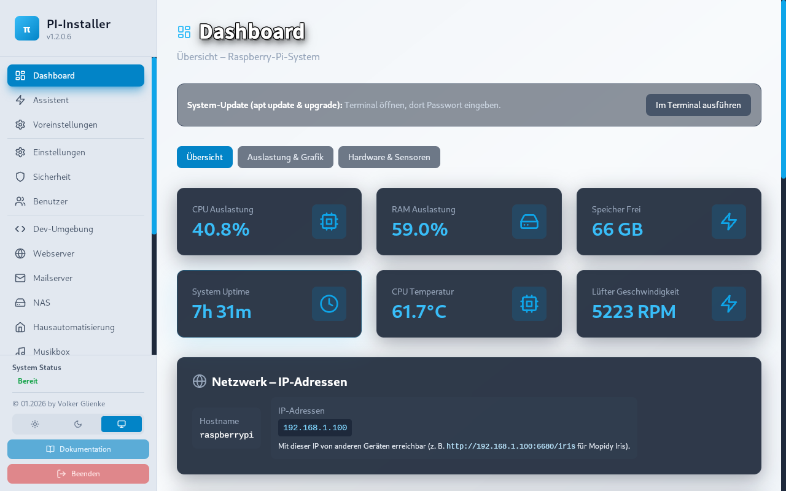
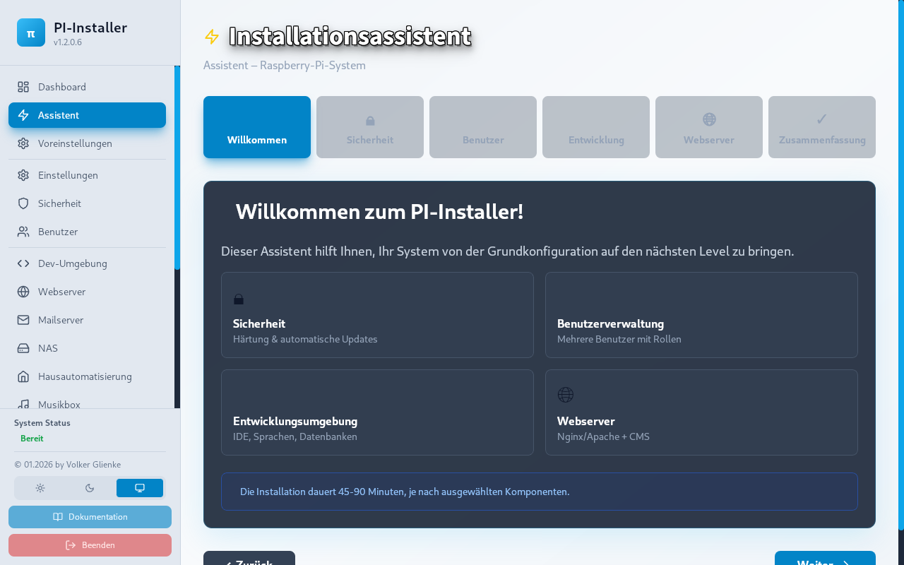
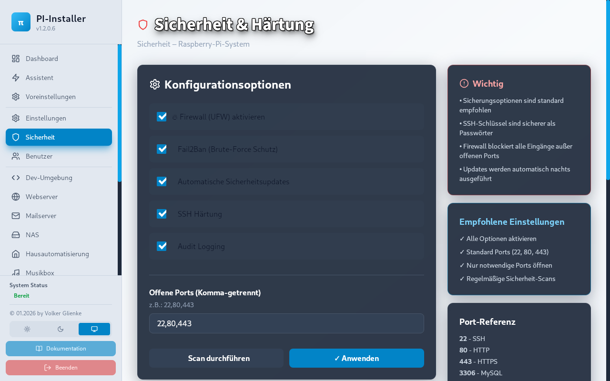
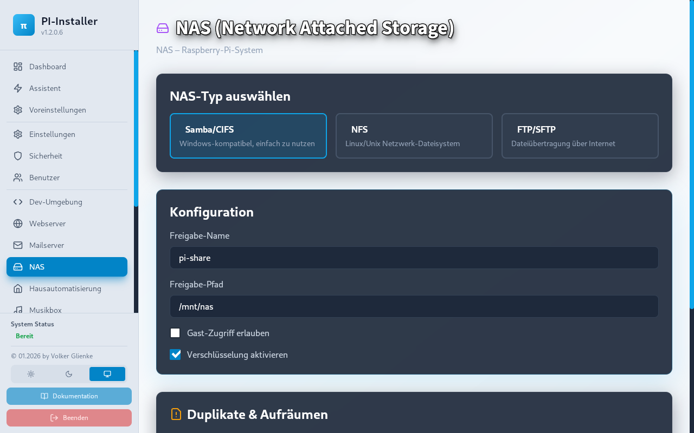
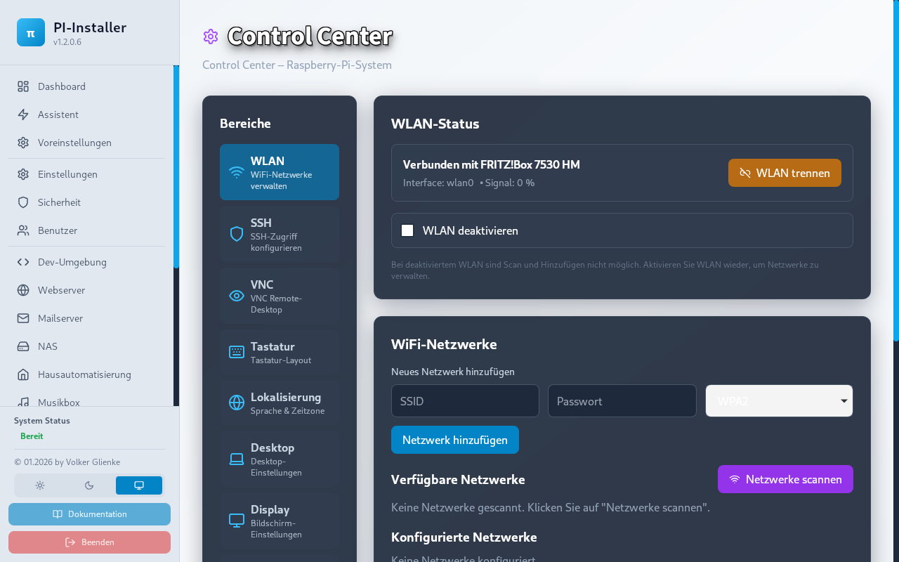
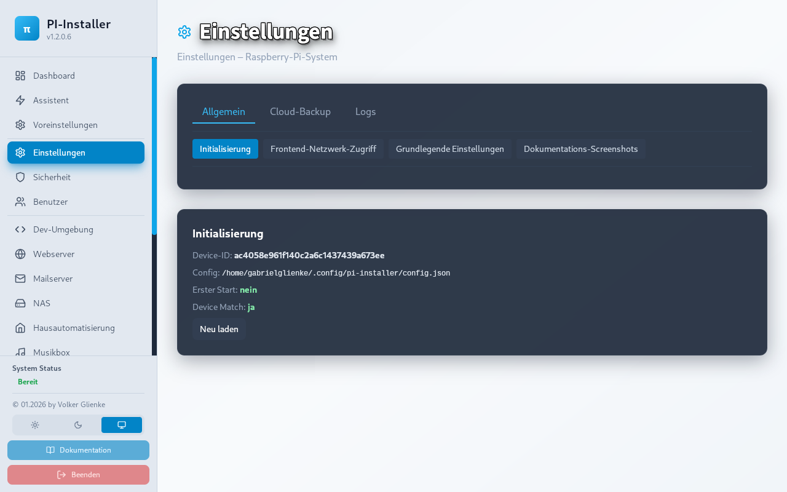

# PI-Installer - Raspberry Pi Konfigurations-Assistent 🥧

[](https://github.com/Yammato-2035/piinstaller/actions/workflows/ci.yml)

Ein umfassendes, **benutzerfreundliches System** zur automatisierten Konfiguration und Härtung eines Raspberry Pi mit moderner Web-GUI. Von der Grundkonfiguration direkt zum produktiven System!

**Neueste Version / Download:** [Releases](https://github.com/Yammato-2035/piinstaller/releases) · [CHANGELOG](CHANGELOG.md)

**Neu ab 1.3.4.0:** Systemweite Installation gemäß Linux FHS (`/opt/pi-installer/`), globale Befehle verfügbar, frühe Dual Display X11-Konfiguration ohne mehrfache Umschaltungen.
**Neu ab 1.3.1.0:** App Store mit 7 Apps, Erste-Schritte-Assistent, Dashboard „Dein Pi läuft!", Mobile-Navigation (Hamburger-Menü), kontextsensitive Hilfe, One-Click-Installer, Laufwerk klonen (Backup & Restore), DSI-Radio (Freenove TFT) mit Lautstärke- und Anzeige-Steuerung.

## 🎯 Kernfeatures

### 1. **Sicherheit & Härtung** 🔒
- Automatische Sicherheitsupdates
- Firewall-Konfiguration (UFW)
- SSH-Hardening
- Fail2Ban Installation
- SSL/TLS Zertifikate
- Port-Management
- System-Audit Logging

### 2. **Benutzerverwaltung** 👥
- Neue Benutzer erstellen
- Rollenbasierte Zugriffe (Admin, Developer, User)
- sudo-Konfiguration
- SSH-Key Management
- Passwort-Policies

### 3. **Entwicklungsumgebung** 💻
- Python/Node.js/Go Installation
- Git & GitHub Integration
- VSCode Server / Cursor AI
- Docker & Docker-Compose
- Datenbanken:
  - PostgreSQL
  - MySQL/MariaDB
  - MongoDB
  - Redis
- Package Managers vorkonfiguriert

### 4. **Webserver-Setup** 🌐
- Nginx/Apache Auto-Configuration
- PHP/Python WSGI Support
- SSL Let's Encrypt
- Reverse-Proxy Setup
- CMS-Installation (WordPress, Drupal, Nextcloud)
- Webadmin Panels (Cockpit, Webmin)

### 5. **Mailserver** 📧
- Postfix + Dovecot
- Spam-Filter (SpamAssassin)
- Backup-Konfiguration

### 6. **Backup & Monitoring** 📊
- Automatische Backups
- System-Monitoring (Prometheus)
- Log-Aggregation
- Performance-Dashboard

## 📋 Systemanforderungen

- Raspberry Pi 4 oder besser
- Raspberry Pi OS (Debian-basiert)
- 4GB+ RAM
- 32GB+ Storage
- Internetzugang

## 🚀 Installation: Zwei Wege

**Hinweis:** Mind. 4 GB RAM, 32 GB SD-Karte empfohlen. Vor größeren Updates: Backup machen.

### Weg 1: Sicher & Manuell (empfohlen für Anfänger)

Klarer Ablauf mit Prüfmöglichkeit – ideal auf jungfräulichem Raspberry Pi:

1. **Raspberry Pi vorbereiten**
   - [Raspberry Pi Imager](https://www.raspberrypi.com/software/) herunterladen.
   - Raspberry Pi OS (64-bit, Lite oder mit Desktop) wählen, SD-Karte schreiben.
   - Vor dem Schreiben: Einstellungen (Zahnrad) → SSH aktivieren, Benutzer/Passwort setzen.
   - SD-Karte einlegen, Pi starten, ins Netzwerk einstecken.

2. **Per SSH einloggen**
   ```bash
   ssh pi@raspberrypi.local
   ```
   (Ersetze `pi` durch deinen Benutzer, falls anders gesetzt.)

3. **Repository klonen und Installer prüfen**
   ```bash
   git clone https://github.com/Yammato-2035/piinstaller.git ~/piinstaller
   cd ~/piinstaller
   less scripts/create_installer.sh
   ```
   Optional: Code durchlesen, dann Installation starten.

4. **Installation starten**
   ```bash
   bash scripts/create_installer.sh
   ```

5. **Im Browser öffnen**
   - Auf einem Gerät im gleichen Netz: `http://raspberrypi.local:3001` (oder die angezeigte IP, z. B. `http://192.168.1.5:3001`).

---

### Weg 2: One-Click mit Verifikation

Schnell, mit Prüfung des Installer-Skripts per Hash:

```bash
curl -sSL https://raw.githubusercontent.com/Yammato-2035/piinstaller/main/scripts/create_installer.sh -o installer.sh
sha256sum installer.sh
```

Vergleiche die Ausgabe von `sha256sum` mit dem für die jeweilige Version angegebenen Hash (siehe [GitHub Releases](https://github.com/Yammato-2035/piinstaller/releases) oder CHANGELOG). Danach:

```bash
bash installer.sh
```

**Ohne Verifikation (weniger sicher):**

```bash
curl -sSL https://raw.githubusercontent.com/Yammato-2035/piinstaller/main/scripts/create_installer.sh | bash
```

Das offizielle Repository ist `Yammato-2035/piinstaller`. Am Ende erscheint die Adresse zum Öffnen (z. B. `http://<IP>:3001`).

---

### Weg 3: .deb-Paket von GitHub (mit Hash-Prüfung)

Ab Version 1.3.9.0 werden bei jedem [GitHub Release](https://github.com/Yammato-2035/piinstaller/releases) ein **.deb-Paket** und eine **SHA256SUMS**-Datei bereitgestellt. Installation inkl. Verifikation:

```bash
# Beispiel – Release-Tag und Dateiname an gewünschte Version anpassen (z. B. v1.3.9.0)
RELEASE="v1.3.9.0"
V="1.3.9.0"
BASE="https://github.com/Yammato-2035/piinstaller/releases/download"
wget "$BASE/$RELEASE/pi-installer_${V}-1_all.deb" "$BASE/$RELEASE/SHA256SUMS"
sha256sum -c SHA256SUMS
sudo apt install ./pi-installer_${V}-1_all.deb
```

Details und manuelles Bauen des .deb: [docs/developer/BUILD_DEB.md](docs/developer/BUILD_DEB.md).

---

### Docker (zum Testen auf dem PC)

Mit installiertem Docker kannst du Backend und Frontend lokal starten (z. B. unter Linux/macOS):

```bash
git clone https://github.com/Yammato-2035/piinstaller.git && cd piinstaller
docker compose up --build
```

Danach: **http://localhost:3001** (Frontend), API unter http://localhost:8000. Geeignet zum Testen, nicht als Ersatz für die Installation auf dem Raspberry Pi.

---

### Manueller Schnellstart (Entwicklung: 3 Schritte)

### Python: 3.9 oder neuer (3.12 empfohlen)

```bash
python3 --version  # Sollte 3.9–3.12 sein
```

Siehe **PYTHON_SETUP.md** bei Problemen oder für Python 3.13.

### 1️⃣ Repository klonen & Backend starten
```bash
cd ~
git clone https://github.com/Yammato-2035/piinstaller.git PI-Installer
cd PI-Installer/backend

# Virtuelle Umgebung (Python 3.9+)
python3 -m venv venv
source venv/bin/activate

# Dependencies installieren
pip install --upgrade pip
pip install -r requirements.txt

# Server starten (Port 8000)
python3 app.py
```

### 2️⃣ Frontend starten (neues Terminal)
```bash
cd PI-Installer/frontend

npm install
npm run dev
```

### 3️⃣ Browser öffnen
```
http://localhost:3001
```

## 📚 Dokumentation

- **[SECURITY.md](./SECURITY.md)** - Sicherheitshinweise, Netzwerk (LAN/Internet), VPN-Empfehlung, CORS
- **[CONTRIBUTING.md](./CONTRIBUTING.md)** - Beitragen (Fork, Branch, PR, Code-Style)
- **[docs/developer/CURSOR_WORK_RULES.md](./docs/developer/CURSOR_WORK_RULES.md)** - Verbindliche Arbeitsregeln (Vorprüfung, i18n, Doku/Changelog/Version, Berichtspflicht); Checkliste und Vorlage im gleichen Ordner
- **[NETWORK_ACCESS.md](./docs/user/NETWORK_ACCESS.md)** - Zugriff im LAN, über VPN, aus dem Internet (nur für erfahrene Nutzer)
- **[INSTALL.md](./docs/user/INSTALL.md)** - Detaillierte Installationsanleitung (inkl. Troubleshooting Mixer)
- **[GUIDED_UX_AND_COMPANION.md](./docs/user/GUIDED_UX_AND_COMPANION.md)** - Einsteigerführung, Erfahrungslevel, Panda-Begleiter, Desktop-Starter
- **[ARCHITECTURE.md](./docs/architecture/ARCHITECTURE.md)** - System-Architektur & Design
- **[FEATURES.md](./docs/architecture/FEATURES.md)** - Alle Features & Roadmap
- **[CHANGELOG.md](./CHANGELOG.md)** - Versions-Changelog (1.2.0.0, 1.0.4.0, …)
- **[VERSIONING.md](./docs/developer/VERSIONING.md)** - Versionsschema, wann Version erhöht wird, Changelog-Führung
- **[SUGGESTIONS.md](./docs/architecture/SUGGESTIONS.md)** - Erweiterte Vorschläge & Best Practices
- **[README_remote_architecture.md](./docs/developer/README_remote_architecture.md)** - Architektur & Integrationsplan Smartphone-Companion (Phase 1, Control Plane)
- **[REMOTE_COMPANION.md](./docs/REMOTE_COMPANION.md)** - Remote Companion: Übersicht, API, Rollen, Events (Phase 1)
- **[REMOTE_COMPANION_DEV.md](./docs/REMOTE_COMPANION_DEV.md)** - Entwicklerleitfaden: neues Modul registrieren, Widgets, Aktionen

## 🎨 GUI-Highlights

### Screenshots

| Dashboard | Assistent | Sicherheit |
|:---:|:---:|:---:|
|  |  |  |

| NAS | Control Center | Einstellungen |
|:---:|:---:|:---:|
|  |  |  |

### Moderne, responsive Web-Oberfläche
- **Dark Mode** mit Sky-Blue Accents
- **Glasmorphism Design** für elegante Ästhetik
- **Echtzeit Updates** mit WebSocket-Support
- **Mobile-freundlich** auf allen Geräten
- **Accessibility Features** (WCAG 2.1)

### Benutzerführung
1. **Dashboard** - Systemübersicht mit Live-Daten
2. **Installationsassistent** - 6-Schritt-Wizard
3. **Modul-Pages** - Detaillierte Konfiguration
4. **Status-Übersicht** - Echtzeit-Monitoring

## 🏗️ Projektstruktur (vereinfacht)

```
PI-Installer/
├── backend/                 # Python/FastAPI Server
│   ├── app.py              # Haupt-Anwendung
│   ├── modules/            # Feature-Module
│   └── requirements.txt     # Dependencies
├── frontend/               # React Web-GUI (optional Tauri-Desktop)
│   ├── src/                # Komponenten & Seiten
│   └── package.json        # Dependencies
├── docs/                   # Architektur-, Benutzer- und Entwicklerdokumentation
├── scripts/                # Installations- und Startskripte
├── config/version.json     # Einzige Versionsquelle (X.Y.Z.W); sync-version.js schreibt daraus VERSION, package.json, Tauri
└── VERSION                 # Wird aus config/version.json geschrieben (Abwärtskompatibilität)
```

## 🔧 API-Übersicht

**Base URL:** `http://localhost:8000/api`

### Security
- `POST /security/scan` - Sicherheits-Scan durchführen
- `POST /security/configure` - Sicherheit konfigurieren
- `GET /security/status` - Status abrufen

### Users
- `GET /users` - Alle Benutzer auflisten
- `POST /users/create` - Neuen Benutzer erstellen
- `DELETE /users/{username}` - Benutzer löschen

### Modules
- `POST /devenv/configure` - Entwicklungsumgebung
- `POST /webserver/configure` - Webserver
- `POST /mail/configure` - Mailserver
- `POST /install/start` - Installation starten

Vollständige API-Dokumentation: `/api/docs`

## 💡 Use Cases

### Für System-Administratoren
- ✅ Schnelle Konfiguration eines Pi-Clusters
- ✅ Standardisierte Sicherheits-Härtung
- ✅ Automatisierte Backup & Monitoring Setup

### Für Entwickler
- ✅ Python/Node.js/Go Entwicklungsumgebung
- ✅ Docker-Support für Containerisierung
- ✅ GitHub Integration für Code-Verwaltung

### Für kleine Unternehmen
- ✅ Web-Hosting auf niedrig-kostigen Hardware
- ✅ Mail-Server Alternative zu cloud services
- ✅ CMS (WordPress, Drupal, Nextcloud)

### Für IoT/Edge Computing
- ✅ Schneller Setup für Edge-Devices
- ✅ Monitoring & Logging Infrastructure
- ✅ Docker-Container Deployment

## 🚀 Performance

- **Frontend Build:** ~150KB (gzipped)
- **Backend Startup:** <2 Sekunden
- **API Response Time:** <100ms
- **Installation Time:** 45-120 Minuten (je nach Auswahl)

## 🔒 Sicherheit

- ✅ Automatische Sicherheitsupdates
- ✅ Firewall-Konfiguration (UFW)
- ✅ SSH-Härtung & Key-Management
- ✅ Fail2Ban Brute-Force Schutz
- ✅ Audit-Logging
- ✅ SSL/TLS mit Let's Encrypt
- ✅ Input Validation & Sanitization

## 🤝 Beitragen

Wir freuen uns über Beiträge! Bitte:
1. Fork das Repository
2. Feature-Branch erstellen (`git checkout -b feature/AmazingFeature`)
3. Änderungen committen (`git commit -m 'Add AmazingFeature'`)
4. Branch pushen (`git push origin feature/AmazingFeature`)
5. Pull Request öffnen

## 🔧 Debugging & Support-Bundle

Schlanke Observability-Infrastruktur (kein UI): JSON-Lines-Debug-Logs mit **run_id** und **request_id**, Scopes, Redaction, optional Support-Bundle. Bei deaktiviertem Debug wird nur noch **ERROR** geloggt.

### Konfiguration

Layering: **backend/debug/defaults.yaml** → **/etc/pi-installer/debug.config.yaml** (optional) → ENV (PIINSTALLER_DEBUG_ENABLED, PIINSTALLER_DEBUG_LEVEL, PIINSTALLER_DEBUG_PATH).

**Beispiel System-Config `/etc/pi-installer/debug.config.yaml`:**

```yaml
global:
  enabled: true
  level: INFO
  sink:
    file:
      path: ""   # leer = /var/log/piinstaller/ oder ~/.cache/piinstaller/logs/
  rotate:
    max_files: 5
    max_size_mb: 10
  privacy:
    sanitize: true
    redact_patterns: ["password\\s*[=:]\\s*\\S+", "token\\s*[=:]\\s*\\S+"]
  export:
    enabled: true
    include_system_snapshot: true
    include_recent_logs: true
    max_log_lines: 5000
scopes:
  modules:
    storage_nvme:
      enabled: true
      level: INFO
      steps:
        detect: { enabled: true, level: INFO }
        apply_boot_config: { enabled: true, level: INFO }
    network:
      enabled: true
      level: INFO
```

### Log-Format (JSON Lines)

Eine Zeile = ein JSON-Objekt. Felder: `ts` (ISO8601, Europe/Berlin), `level`, `run_id`, `request_id` (nullable), `app`, `scope`, `event`, `context`, `metrics`, `data`. Event-Typen: `RUN_START`, `RUN_END`, `STEP_START`, `STEP_END`, `DECISION`, `APPLY_ATTEMPT`, `APPLY_NOOP`, `APPLY_SUCCESS`, `APPLY_FAILED`, `ERROR`.

**Beispiel Log-Event:**

```json
{"ts":"2025-03-05T15:22:01.123+01:00","level":"INFO","run_id":"a1b2c3d4-e5f6-7890-abcd-ef1234567890","request_id":"b2c3d4e5-f6a7-8901-bcde-f23456789012","app":{"name":"piinstaller","version":"1.3.7.4","build":""},"scope":{"module_id":"storage_nvme","step_id":"apply_boot_config"},"event":{"type":"APPLY_NOOP","name":"write_config"},"context":{},"metrics":{},"data":{"keys_count":12,"reason":"config_unchanged"}}
```

### Support-Bundle erstellen

Zip mit Debug-Logs (redigiert), System-Logs (/var/log/pi-installer, begrenzt), System-Snapshot (ohne Secrets), effektiver Config und Manifest:

```bash
./scripts/support-bundle.sh
# oder aus backend:
cd backend && python3 -m debug.cli support-bundle [output_dir]
```

**Ausgabe:** `output_dir/piinstaller-support-<timestamp>-<run_id>.zip` mit u. a. `system_snapshot.json`, `debug.config.effective.yaml`, `logs/debug_recent.jsonl`, `logs/system_pi_installer.txt`, `manifest.json` (bundle_version, created_at, run_id, redaction_enabled).

### Integration in Module

```python
from debug import get_logger

log = get_logger("mein_modul", "mein_step")
log.step_start("name", data={...})
# ... Arbeit ...
log.step_end("name", duration_ms=123, data={...})
log.decision("name", data={...})
log.apply_noop("name", data={...})   # wenn bereits korrekt (idempotent)
log.apply_success("name", data={...})
log.apply_failed("name", error="...", data={...})
log.error("msg", error_code="E001", data={...})
```

### Lokal starten & Logs finden

- **Backend starten:** `./scripts/start-backend.sh` bzw. `cd backend && uvicorn app:app --host 0.0.0.0 --port 8000`
- **Debug-Logs:** Primär `/var/log/piinstaller/piinstaller.debug.jsonl`, Fallback `~/.cache/piinstaller/logs/piinstaller.debug.jsonl`
- **System-Logs (App):** `/var/log/pi-installer/` (bei System-Installation)
- **Vollständige Debug-Doku** (Aktivierung, Scopes, Support-Bundle-Optionen): [backend/debug/README.md](backend/debug/README.md)

## 📞 Support & Kontakt

- **GitHub Issues** - Bug Reports & Feature Requests
- **Diskussionen** - Community Support
- **Email** - support@pi-installer.local

## 📝 Lizenz

MIT License - Siehe [LICENSE](./LICENSE) für Details

## 🙏 Danksagungen

- Raspberry Pi Foundation
- FastAPI Community
- React Community
- Tailwind CSS
- Alle Mitwirkenden

---

## 🌟 Status

- **Version:** siehe [config/version.json](./config/version.json) (eine Quelle; [VERSIONING.md](./docs/developer/VERSIONING.md))
- **Status:** Production Ready
- **Letztes Update:** Februar 2026
- **Support bis:** Januar 2027

### Weitere Informationen
- 📖 **[Detaillierte Docs](./INSTALL.md)**
- 🏗️ **[Architektur](./ARCHITECTURE.md)**  
- 🎯 **[Features & Roadmap](./FEATURES.md)**
- 💡 **[Erweiterte Tipps](./SUGGESTIONS.md)**
