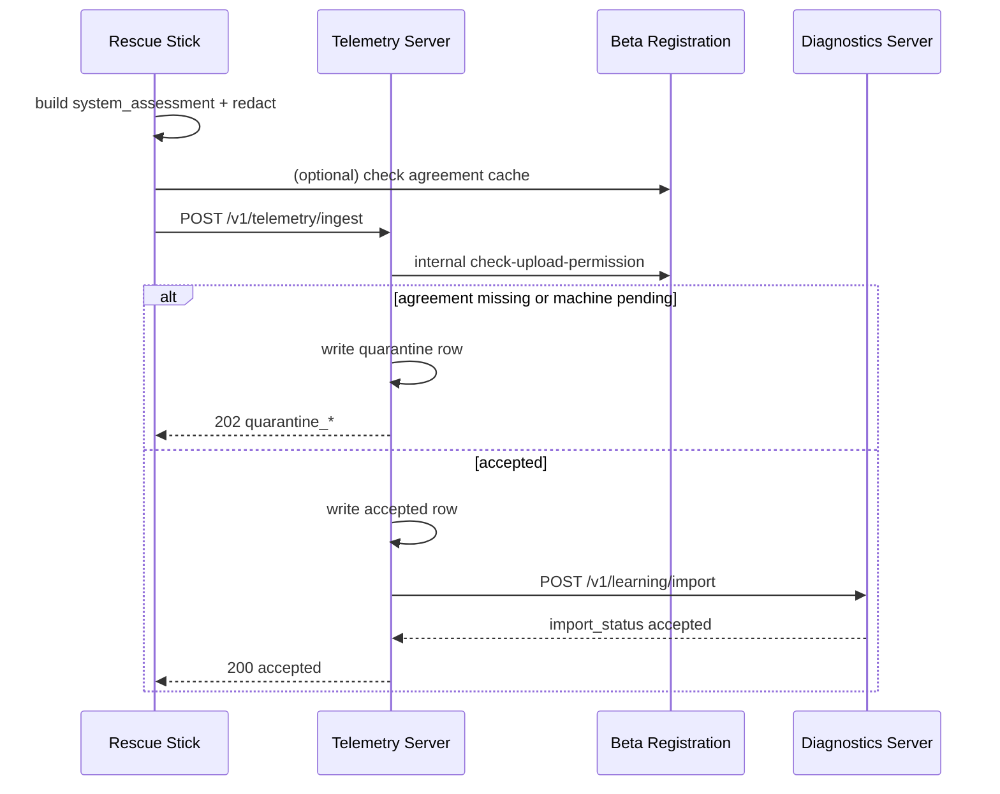

# Beta Data Flow V1

**Version:** 1.0 · **Focus:** Quarantine paths, retention, and state transitions  
**Contracts:** `beta_agreement_gate_v1.py`, `beta_machine_approval_contract_v1.py`, `rescue_telemetry_client_contract_v2.py`

---

## 1. Overview

Beta telemetry flows through **four logical stores**:

1. **Stick spool** (USB/local) — offline queue  
2. **Telemetry quarantine** — server-side hold bucket  
3. **Telemetry accepted** — durable ingest ready for forward  
4. **Diagnostics learning** — hardware-correlated, review-gated  

No path bypasses redaction on the stick or PII scan on diagnostics import.

---

## 2. End-to-end sequence



---

## 3. Upload mode gating (stick-side)

`TelemetryUploadMode` values and when they apply:

| Mode | When active |
|------|-------------|
| `disabled` | Operator policy or build flag |
| `dry_run_local` | Validate only, no network |
| `mock_server` | CI / lab port 8101 |
| `dev_laptop_lab` | Developer QEMU profile |
| `beta_server_quarantine` | Stick verified but agreement or approval incomplete |
| `beta_server_accepted` | Stick verified + agreement valid + machine approved |

Function `upload_allowed_for_mode()` in `rescue_telemetry_client_contract_v2.py` is authoritative on the client.

---

## 4. Quarantine triggers

| Trigger | HTTP | `status` (examples) | Forward to DS |
|---------|------|---------------------|---------------|
| Invalid schema | 400 | `rejected_schema` | No |
| Unknown stick | 403 | `rejected_auth` | No |
| Email not verified | 202 | `quarantine` (via BR gate) | No |
| MFA missing | — | `restricted_local_only` (no upload) | No |
| Agreement missing | 202 | `quarantine_pending_agreement` | No |
| Agreement expired | 202 | `quarantine` + retention 14d | No |
| Machine `pending` | 202 | `quarantine_pending_approval` | No |
| Machine `blocked` | 403 | `rejected_machine` | No |
| PII detected at DS | 422 | `rejected_pii` | No |

Retention for missing agreement: **14 days** (`QUARANTINE_RETENTION_DAYS_MISSING_AGREEMENT`).

---

## 5. Quarantine storage layout (telemetry server)

Logical tables (see `sql/telemetry_server_schema_v1.sql`):

```
telemetry_events_quarantine
  event_id, stick_id, machine_fingerprint, reason, payload_json, created_at, expires_at

telemetry_events_accepted
  event_id, stick_id, ingest_status, diagnostics_forwarded, created_at

telemetry_forward_outbox
  event_id, target_ds, attempts, last_error
```

**Promotion path:** quarantine → accepted only after BR returns `upload_allowed: true` and OP sets machine `approved` (batch job or inline on permission re-check).

---

## 6. Diagnostics learning path

After accept:

1. TS strips transport metadata, attaches `hardware_key` derived from redacted assessment.  
2. DS validates against `diagnostics_learning_import_contract_v1.schema.json`.  
3. DS runs PII walker (same key set as mock: `email`, `ip`, `mac`, …).  
4. Row lands in `hardware_observations` with `review_required: true` until operator sign-off.

Learning export is **never** allowed for quarantine rows (`learning_export_allowed: false` in mock responses).

---

## 7. Stick-local spool and privacy

Offline or `restricted_local_only`: events spool under `/setuphelfer/evidence/telemetry/`; `retry_telemetry_queue` replays FIFO on reconnect (dedupe by `event_id`). All `privacy.contains_*` flags must remain **false** before send.

Related: `BETA_MACHINE_APPROVAL_FLOW_V1.md`, `TELEMETRY_SERVER_BETA_0_1.md`, `telemetry_server_ingest_contract_v1.schema.json`.
