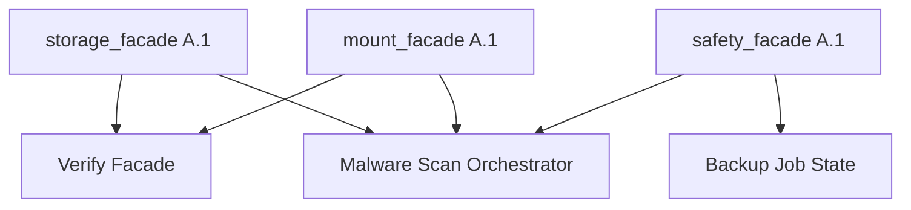

# Future Facade Candidates

**Phase:** Nach Core Facade Freeze A.1 (Storage, Mount, Safety)  
**Priorität:** LOW → CRITICAL

| # | Facade | Beschreibung | Priorität | Begründung |
|---|--------|--------------|-----------|------------|
| 1 | **Verify Facade** | Einheitliche Verify-Shallow/Deep-Orchestrierung, Evidence-Envelope | **CRITICAL** | Duplikate in Deploy-Runnern, `app.py`, Rescue-Verify |
| 2 | **Backup Job State Facade** | Job-Lifecycle, Progress, Cancel — entkoppelt von `backup_engine` + UI | **HIGH** | `BackupRestore.tsx` + `backup_engine` + API verflochten |
| 3 | **DCC Status Facade** | Development Control Center: deploy_drift, health, fleet | **HIGH** | `dev_dashboard.py`, Evidence-JSON, Frontend-DCC |
| 4 | **Deploy Runner Registry** | Kanonische Runner-IDs, Metadaten, Lifecycle | **HIGH** | 115 Runner, ~37k Zeilen, schwer auffindbar |
| 5 | **Notification Facade** | Toast/Banner/Audit-Events einheitlich | **MEDIUM** | Frontend + Backend Event-Duplikate |
| 6 | **Companion Status Facade** | Rescue-Agent / Fleet-Session Status | **MEDIUM** | Fleet + Rescue-Agent parallele Statuspfade |
| 7 | **Malware Scan Orchestrator Facade** | Scan-Jobs, Quarantine, Readonly-Mount-Kopplung | **LOW** | Zukünftiges Modul, hängt an Storage/Mount-Facades |

## Abhängigkeiten

## Empfohlene Reihenfolge

1. Verify Facade (CRITICAL) — blockiert saubere Rescue/Backup-Akzeptanz  
2. Backup Job State + DCC Status (HIGH) — entlastet Monolith-UI  
3. Deploy Runner Registry (HIGH) — Governance für 115 Runner  
4. Notification + Companion (MEDIUM)  
5. Malware Scan Orchestrator (LOW) — nach Storage/Mount/Safety-Migration
