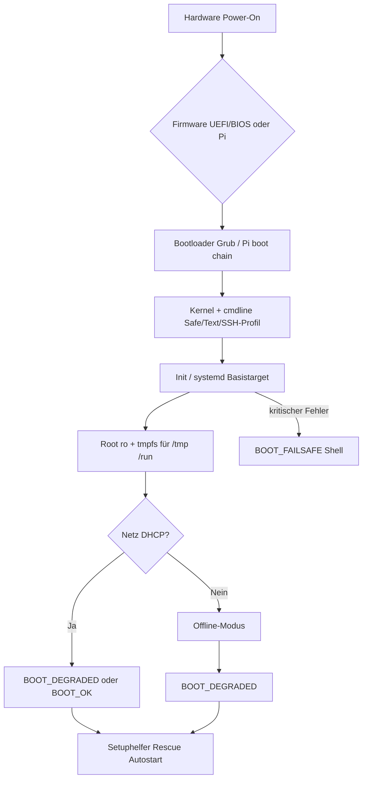

# Rescue-Stick / Bootstick – Architektur (Phase 0)

## Zielbild

Ein **minimal bootfähiges**, **offline-first** System, das den Setuphelfer in einem **eingeschränkten Rescue-Modus** startet. Schwerpunkt: **Read-Only-Analyse** des Zielsystems ohne persistente Änderungen am Bootmedium.

## Boot- und Laufzeit-Anforderungen

### Plattformen

| Plattform | Firmware | Hinweise |
|-----------|----------|----------|
| x86_64 | UEFI und BIOS (CSM/Legacy) | Zwei Bootpfade (ESP + MBR/VBR) im Zielbild; gemeinsames Root (squashfs + overlay tmpfs). |
| Raspberry Pi | U-Boot / Firmware, `bootfs` + `rootfs` | Device-Tree / Kernel aus `/boot/firmware` bzw. vorgegebenem Layout; ARM-kompatible Userspace-Basis. |

### Fallback-Modi (Konzept)

- **Safe Mode (no GPU)**: Kernel-Parameter z. B. `nomodeset`, `modprobe.blacklist=...` – reduziert Treiberlast, Textkonsole.
- **Text Mode**: Kein grafischer Stack; nur Getty / serielle Konsole.
- **SSH Mode (Headless)**: Netzwerk per DHCP; `sshd` aktiv; optional feste Anzeige der IP (seriell oder kleines Status-Programm).

Die konkrete Parametrisierung erfolgt in einer späteren Phase (Bootloader-Konfiguration); hier nur **Zustände** und **Reihenfolge** definiert.

## Systemverhalten

| Aspekt | Vorgabe |
|--------|---------|
| Root-Dateisystem | **read-only** (z. B. squashfs oder ro gemountetes Image) |
| Schreibbare Bereiche | nur **`tmpfs`** (`/tmp`, `/run`, ggf. `/var/tmp`) |
| Bootstick | **keine** persistenten Änderungen am Medium im Normalbetrieb |

## Startlogik

1. Kernel + initramfs (falls verwendet) laden minimales Userspace.
2. Basisdienste: udev, Netzwerk (DHCP), Logging.
3. **Autostart** eines minimalen Setuphelfer-Rescue-Dienstes (Backend + optional schlanke UI oder nur CLI).
4. **Kein Desktop-Zwang** – CLI ist Referenz; optionale minimale UI nur wenn im Image vorhanden.

## Netzwerk

- **Primär:** DHCP auf allen relevanten Schnittstellen (Ethernet; WLAN optional vorbereitet).
- **Offline:** Wenn kein Lease / kein Link → **Offline-Modus**; Diagnose läuft lokal weiter.
- **WLAN Quick-Setup:** nur als **Stub/Hook** dokumentiert (keine Implementierung in Phase 0/1).

## Boot-States (Semantik)

| State | Bedeutung |
|-------|-----------|
| **BOOT_OK** | System vollständig gebootet; Rescue-Stack startfähig; kritische Dienste (Diagnose-API/CLI) verfügbar. |
| **BOOT_DEGRADED** | Boot erfolgreich, aber eingeschränkt (z. B. kein Netz, GPU-Safe-Mode, fehlende optionale Komponente). |
| **BOOT_FAILSAFE** | Minimalfunktion (z. B. nur serielle Shell / Notfall-Shell); Rescue-Autostart ggf. manuell oder stark reduziert. |

Übergänge: Firmware/Kernel → Init → Netzwerk optional → Setuphelfer Rescue. Detailliertes **Ablaufdiagramm** siehe unten.

## Bootablauf (Diagramm)

## Sicherheitsprinzip

- **Read-Only bis explizite Freigabe:** Phase 1 beschränkt sich auf Analyse-API/CLI ohne Restore, ohne Schreibzugriff auf erkannte Systemlaufwerke, ohne automatisches **Schreib**-Mount.

## Abgrenzung Phase 0

- **Keine** echte ISO-/Image-Erzeugung, kein Installer für den Stick in diesem Dokument.
- Umsetzung Boot-Medium = **spätere Phase** (Build-Pipeline, Paketliste, Signierung).

## Bezug zur Diagnose-Engine (Phase 1)

Die Read-Only-Diagnose (`/api/rescue/analyze`, `scripts/rescue_mode.py`) ist unabhängig vom Boot-Medium konzipiert und kann auf dem installierten System oder im Rescue-Image gleichermaßen laufen – Voraussetzung: gleiche Backend-Module und keine zusätzlichen externen Python-Pakete.
