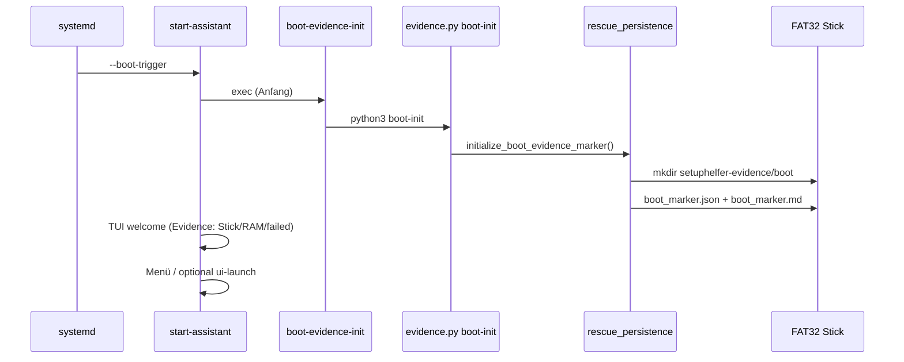

# Rescue Boot Persistence (R.6)

**Version:** 1.7.17.0 · **Phase:** R.6  
**Ziel:** Frühestmöglich beim Live-Boot kanonischen Evidence-Baum auf dem Stick anlegen.

## Erfolgskriterium

Nach MSI-Boot mit gestartetem Linux/TUI/Kiosk muss existieren:

```
/setuphelfer-evidence/boot/boot_marker.md
```

(plus `boot/boot_marker.json`)

## Ablauf



## Stick-Erkennung

Reihenfolge (`detect_rescue_stick_mount`):

1. `/run/live/medium` (Debian live standard)
2. `/lib/live/mount/medium` (ältere live images)
3. `/media/*/SETUPHELFER` (manueller Desktop-Mount)

Schreibziel nur bei erkanntem Stick und sicherem Ziel (keine Systemplatten). Bei read-only FAT: remount-Versuch, sonst RAM-Fallback `/tmp/setuphelfer-evidence`.

## Komponenten

| Datei | Funktion |
|-------|----------|
| `scripts/.../setuphelfer-rescue-boot-evidence-init` | Shell-Wrapper |
| `scripts/.../setuphelfer-rescue-evidence.py boot-init` | CLI |
| `backend/core/rescue_persistence.py` | `initialize_boot_evidence_marker` |
| `scripts/.../setuphelfer-rescue-start-assistant` | Ruft Hook vor UI/Menü auf |

## Matrix (R.6)

Neue Einträge in `rescue_test_matrix`:

- `boot_marker_written`
- `evidence_root_created`
- `evidence_target_is_stick`
- `evidence_target_is_ram_fallback`
- `start_assistant_invoked`

## Abgrenzung

- **Nicht** Write-Time (USB-Writer legt nur `setuphelfer/rescue/*` ab)
- **Nicht** Legacy-Mirror (`setuphelfer/evidence/` unter FAT-Root)
- **Ende-Assistent** `bundle` bleibt für vollständiges Summary

## Referenzen

- `docs/evidence/rescue/R6_PERSISTENCE_BOOT_HOOK_AUDIT.md`
- `docs/architecture/RESCUE_STICK_LOGGING_AND_TESTMATRIX_R3.md`
