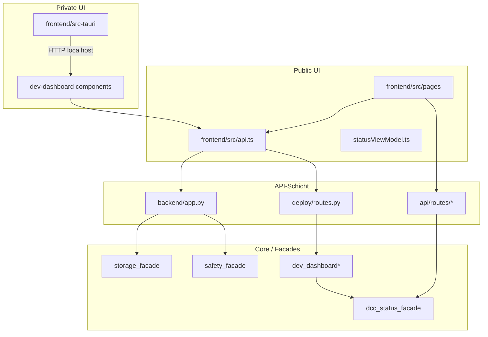

# Module-Coupling-Audit — Python, Frontend, Tauri

**Datum:** 2026-06-16  
**Quellen:** `python_imports.tsv`, `frontend_imports.txt`, `rg`-Fan-in, Routen-Dekoratoren  
**Scope:** Kopplungsrisiken zwischen Schichten und Public/Private-Grenzen

## Kopplungsübersicht



## Python — Fan-in-Kandidaten (hohe Abhängigkeit)

| Modul | Fan-in (Backend `.py`) | Rolle | Kopplungsrisiko |
|-------|------------------------|-------|-----------------|
| `backend/app.py` | Zentraler Import-Hub; ~50+ Module direkt | HTTP + Business-Legacy | **kritisch** — jede Änderung regressionsanfällig |
| `backend/core/dev_dashboard.py` | ~23 | DCC-Status-Aggregation | hoch — viele Deploy/Rescue-Imports |
| `backend/core/safe_device.py` | ~13 | Write-Protection | hoch — Safety-kritisch, Legacy-Direktimporte |
| `backend/core/dcc_status_facade.py` | ~11 | DCC Read-model | mittel — gewünschter Sammelpunkt |
| `backend/core/safety_facade.py` | ~9 | Safety-Facade | mittel — Zielbild für neue Imports |
| `backend/core/storage_facade.py` | ~8 | Storage-Facade | mittel — noch nicht durchgängig |
| `backend/deploy/routes.py` | ~9 interne Runner-Imports | Deploy-HTTP-Monolith | hoch — parallel zu `app.py` |

### Python — Public/Private-Import-Risiken

| Risiko | Beschreibung | Betroffene Pfade | Empfehlung |
|--------|--------------|------------------|------------|
| **Private über Public-API** | `deploy/routes.py` Endpunkte im Release erreichbar wenn Profil-Gate fehlt | `deploy/*`, DCC-Frontend | Profil-Gate + `capabilities` API strikt halten |
| **Legacy-Bypass der Facades** | `app.py` importiert `storage_discovery` und `safe_device` direkt | `app.py`, `modules/storage_detection.py` | Neue Features nur über `storage_facade` / `safety_facade` |
| **Test-Patches auf `app`** | Tests patchen `app_module.validate_backup_target` | `test_backup_full_excludes_fix13_v1.py` u. a. | Ziel-Funktion nach `core/backup_*` extrahieren |
| **Cross-Domain in einem File** | `app.py` mischt Backup, Network, Monitoring, Sessions | `app.py` | Router-Slices (`api/routes/*`) — bereits begonnen (`status`, `health`, `version`, `backup_readonly`) |
| **Rescue-Ingest vs. API** | `rescue_telemetry/routers.py` separater Prefix `/api/rescue/telemetry` | `core/rescue_telemetry_ingest.py` | **private_only** — klar dokumentieren: lokaler Dev-Ingest, nicht öffentlicher Telemetrie-Server |

### Begonnene Entkopplung (positiv)

- `app_bootstrap/router_registry.py` — Router-Registrierung ausgelagert.
- `api/routes/dev_dashboard_readonly.py`, `control_center_readonly.py` — Read-only-Slices ohne `app.py`-Duplikat.
- Tests `test_*_without_app_dependency_*` — Facades sollen ohne `app`-Import testbar sein (`network_facade`, `system_info`).

## Frontend — Kopplung

| Muster | Dateien | Risiko |
|--------|---------|--------|
| **Page → viele APIs** | `BackupRestore.tsx`, `ControlCenter.tsx` | hoch — UI-Monolith zieht 5–10 API-Module |
| **Zentrale `fetchApi`** | `frontend/src/api.ts` | niedrig — gewünschter Single-Client |
| **Direkt-Fetch in Komponenten** | `PartitionWorkbenchShell.tsx` | mittel — umgeht Sub-API-Schicht |
| **Status-Doppelpfad** | `statusViewModel.ts` + `trafficLightModel.ts` + Backend `dcc_status_facade` | mittel — konvergierende Semantik, getrennte Schichten OK |
| **i18n-Monolith** | `locales/de.json`, `en.json` (3.379 Z.) | mittel — alle Domänen in einer Datei |
| **Dev-Dashboard-Cluster** | `components/dev-dashboard/*`, `lib/devDashboard/*` | niedrig (private) — klar vom Public-Sidebar getrennt |

### Frontend Public/Private

| Bereich | Public-Relevanz | Kopplung |
|---------|-----------------|----------|
| `pages/BackupRestore`, `Dashboard`, `ControlCenter` | Public | Nur `api/routes` + schlanke `api/*`; kein `devDashboardApi` |
| `pages/ExternalDevelopmentControlCenter`, `DevelopmentEnv` | Private | Darf `deploy`-nahe APIs und `devDashboardApi` nutzen |
| `lib/devDashboard/dccDeveloperToken.ts` | Private | Token nur für DCC — nicht in Public-Pages importieren |

## Tauri — Kopplung

| Aspekt | Befund |
|--------|--------|
| **Pfad** | `frontend/src-tauri/` (kein Repo-Root `src-tauri/`) |
| **Rust-Umfang** | ~362 Zeilen (`lib.rs` 141, `dev_dashboard_standalone.rs` 215, `main.rs` 6) |
| **Backend-Kopplung** | **Keine direkte Python/Rust-FFI** — nur HTTP zu Vite-Dev-Server (`localhost:5173`) oder gebündeltem Frontend |
| **Hauptfunktion** | `open_development_cockpit` — separates Webview-Fenster für DCC |
| **Risiko** | niedrig — Tauri ist Shell; Business-Logik bleibt in TS/Python |

Tauri importiert weder `backend/app.py` noch Core-Module. Die Kopplung läuft ausschließlich über das Frontend und HTTP — das reduziert Rust↔Python-Fan-in auf null.

## Querschnitt — kritische Abhängigkeitsketten

### 1. Backup-Pfad (Public)

```
BackupRestore.tsx → api.ts → app.py / backup_readonly
  → backup_target_service_access / backup_runner (CLI)
  → safe_device / storage_detection (Legacy)
```

**Risiko:** Safety-Logik nicht durchgängig über `safety_facade`.  
**Maßnahme:** `tests_first` auf Backup-Target-Diagnose-IDs, dann Facade-Zwang.

### 2. Deploy/DCC-Pfad (Private)

```
ExternalDevelopmentControlCenter → devDashboardApi → deploy/routes.py
  → dev_dashboard.py / dev_dashboard_cockpit.py
  → deploy_manifest / profile_deploy_manifest (deploy_drift)
```

**Risiko:** Drift-Logik in mehreren Aggregatoren.  
**Maßnahme:** `dcc_status_facade` als einziges Read-model für UI.

### 3. Rescue-Telemetrie (Private Lab)

```
rescue_stick / Windows-Agent → /api/rescue/telemetry → rescue_telemetry_ingest.py
```

**Wichtig:** `rescue_telemetry_ingest.py` ist **lokaler Dev-Ingest** (JSONL/Queue, HMAC optional) — **nicht** ein öffentlicher Telemetrie-Server und nicht mit Produkt-Analytics zu verwechseln.

### 4. Safety-Pfad (Public-kritisch)

```
storage_detection / app.py → safe_device → write_guard
                     ↘ safety_facade (Ziel)
```

**Maßnahme:** `wrap_with_facade` — neue Consumer nur `safety_facade`.

## Import-Risiko-Matrix (vereinfacht)

| Von → Nach | `app.py` | `deploy/routes` | Core-Facades | Frontend Public | Tauri |
|------------|----------|-----------------|--------------|-----------------|-------|
| `app.py` | — | selten | soll ↑ | via HTTP | nein |
| `deploy/routes` | nein | intern | teilweise | via HTTP (DCC) | nein |
| Tests | patcht oft | importiert Runner | direkt | — | — |
| `modules/*` | importiert von app | selten | umgeht teils | — | nein |

## Empfohlene Governance-Regeln

1. **Keine neuen direkten Imports** von `safe_device`, `write_guard`, `storage_discovery` außerhalb der jeweiligen Facade.
2. **Neue HTTP-Routen** nur in `api/routes/` oder thematischen `deploy/routes/*`-Splits — nicht in `app.py`.
3. **Public-Frontend** importiert keine `lib/devDashboard/*` oder `devDashboardApi`.
4. **`rescue_telemetry_ingest`** bleibt hinter Env-Flag und Profil-Gate; nicht in Public-OpenAPI dokumentieren.
5. **Phase-0-Gates** (`scripts/check-*-gate.sh`) vor Runtime-Tests — unabhängig von Code-Coupling.

## Referenzdateien

- `docs/evidence/monolith/python_imports.tsv` — vollständiger Backend-Importgraph
- `docs/evidence/monolith/frontend_imports.txt` — Frontend-Importgraph
- `scripts/check-module-boundaries.sh` — automatisierte Grenzprüfung
- `backend/core/safety_facade.py` — Facade-Freeze-Kommentar
- `backend/core/rescue_telemetry_ingest.py` — Docstring: „not DCC, not dev-server“
