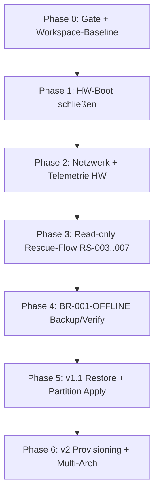

# Setuphelfer Rettungsstick — Input für mehrphasigen Umsetzungs-Prompt

**Analyse-Datum:** 2026-06-09 · **HEAD:** `6f3c783` · **Basis:** `RESCUE_STICK_IST_ANALYSIS.md`, `RESCUE_STICK_CAPABILITY_MATRIX.yaml`, `RESCUE_STICK_GAP_LIST.md`

> Diese Datei ist **kein** Umsetzungs-Prompt. Sie liefert strukturierte Eingaben für die Prompt-Generierung.

---

## 1. Empfohlene Phasen und Reihenfolge



| Phase | Ziel | Dauer-Schätzung | Freigabe-Kriterium |
|-------|------|-----------------|-------------------|
| **0** | Reproduzierbare Baseline | 1 Prompt | Gate dokumentiert, Version konsistent, fremde Changes isoliert |
| **1** | Physisches UEFI-Boot | **Payload+Verify grün — HW-Retest pending** | RS-001 grün nach Operator-Boot ohne Live-Medium-Warnung |
| **2** | Netzwerk + Telemetrie auf gleicher HW | 1 Prompt | Onboarding OK, ACK, kein Secret-Leak |
| **3** | Start Assistant read-only E2E | 1–2 Prompts | RS-002…007 grün (ohne Restore-Write) |
| **4** | BR-001-OFFLINE | 2+ Prompts | Full-Root extern, SHA256, Verify Deep |
| **5** | v1.1 Writes (Restore, Partition) | separater Strang | BR-Gates + Operator-Confirm |
| **6** | v2 Provisioning, ARM, i18n global | Roadmap | Eigene Gates |

**Nicht parallel zu Phase 1–4 starten:** Provisioning, Pi-Images, Partitions-Write, Restore-Execute, Secure-Boot.

---

## 2. Abhängigkeiten

| Abhängigkeit | Blockiert | Bis erfüllt |
|--------------|-----------|-------------|
| ISO-Rebuild (1.7.9.0 Workspace) | USB-Write, HW-Tests | Phase 1 Start |
| HW-Boot (RS-001) | RS-002…008, BR-001-OFFLINE | Phase 1 Ende |
| Netzwerk+Telemetrie HW | Windows-Inspect, Task-Pull | Phase 2 Ende |
| Backup-Fund read-only | Verify-Preview sinnvoll | Phase 3 |
| BR-001-OFFLINE Archiv | Restore-Execute Freigabe | Phase 4 |
| Restore-Execute Gate | Partition Apply mit Daten | Phase 5 |

**Kritischer Pfad:** `live-build-Tree → ISO-Build → USB-Write (Operator) → HW-Boot → Netzwerk → Telemetrie → Discovery → Backup → Verify`

---

## 3. Tests vor/nach jeder Phase

### Phase 0 (vor jeder Runtime-Phase)

```bash
./scripts/check-runtime-deploy-gate.sh   # oder check-runtime-profile-deploy-gate.sh
python3 backend/tools/check_version_consistency.py --repo-root .
git status --short
```

- `GET /api/version` → 200, `project_version` = `config/version.json`
- Kein Deploy ohne explizite Freigabe

### Phase 1 — vor

- `validate-controlled-live-build-tree.sh` Exit 0
- `controlled_iso_build_latest_summary.json` oder frischer Build

### Phase 1 — nach

- RS-001 Evidence JSON aktualisieren
- USB-Readback SHA256 = ISO SHA256
- Operator dokumentiert UEFI-Fehlermodus (Menu sichtbar? GRUB? Kernel?)

### Phase 2 — nach

- Onboarding-JSON unter `/run/setuphelfer-rescue/`
- Telemetrie-ACK auf Dev-Server/LAN-Proxy
- `test_rescue_network_menu_no_secret_logging_v1.sh` grün

### Phase 3 — nach

- `wizard-state.json` vollständig
- RS-002…007 Evidence
- Kein Write auf interne Platten (Audit-Log)

### Phase 4 — nach

- BR-001-OFFLINE Evidence mit `executed_at` gesetzt
- Verify Deep auf demselben Archiv wie Backup
- `backup_restore_release_gate.json` Ampel-Update (nur bei echtem Nachweis)

---

## 4. Sicherheitsregeln für Folge-Prompts

**Immer einbinden:**

- Phase-0-Gate vor Runtime-Schritten
- `--operator-confirm-build` / `--operator-confirm-write` für ISO/USB
- `usb_write_allowed: false` default — kein API-auto-write
- `write_allowed=false` / `restore_execution_allowed=false` bis explizite Gate-Freigabe
- Dry-run default für destruktive Pfade
- Kein Backup/Restore/Verify gegen echte Nutzdaten ohne Operator-Freigabe
- Kein `sudo`/`apt`/`systemctl restart` ohne Auftrag
- Fremde uncommitted Changes (z. B. `ckb-next`) nicht anfassen
- Evidence nach jedem Operator-Lauf unter `docs/evidence/runtime-results/rescue/`

**Bei Gate Exit 20:** Analyse/Workspace-Arbeit erlaubt; Runtime nur mit Profil-Gate oder dokumentierter Ausnahme.

---

## 5. Dateien/Module — Reihenfolge

### Phase 1 (zuerst)

| Priorität | Pfad |
|-----------|------|
| 1 | `build/rescue/live-build/setuphelfer-rescue-live/` |
| 2 | `scripts/rescue-live/prepare-controlled-live-build-tree.sh` |
| 3 | `scripts/rescue-live/run-controlled-iso-build-with-logging.sh` |
| 4 | `scripts/rescue-live/patch-rescue-iso-uefi-x64.sh` |
| 5 | `scripts/rescue-live/validate-rescue-iso-uefi-boot.sh` |
| 6 | `scripts/rescue-live/write-fat32-esp-rescue-usb.sh` (Alternative) |
| 7 | `backend/core/rescue_iso_build_executor.py` |
| 8 | `backend/core/rescue_fat32_esp_usb_writer.py` |

### Phase 2

| Priorität | Pfad |
|-----------|------|
| 1 | `scripts/rescue-live/image/setuphelfer-rescue-network-onboarding` |
| 2 | `scripts/rescue-live/image/setuphelfer-rescue-common.sh` |
| 3 | `scripts/rescue-live/image/setuphelfer-rescue-telemetry-push` |
| 4 | `backend/core/rescue_network_telemetry_gate.py` |
| 5 | `backend/core/rescue_telemetry_ingest.py` |

### Phase 3

| Priorität | Pfad |
|-----------|------|
| 1 | `scripts/rescue-live/image/setuphelfer-rescue-start-assistant` |
| 2 | `scripts/rescue-live/image/setuphelfer-rescue-disk-discovery.py` |
| 3 | `backend/modules/rescue_backup_discovery.py` |
| 4 | `backend/modules/rescue_restore_dryrun.py` |
| 5 | `apps/partitionshelfer/core/restore_handoff_contract.py` |

### Phase 4

| Priorität | Pfad |
|-----------|------|
| 1 | `backend/tools/backup_runner.py` |
| 2 | `backend/modules/backup_engine.py` |
| 3 | `backend/modules/backup_verify.py` |
| 4 | `backend/deploy/runner_rescue_backup_discovery_verify.py` |

### Später (v1.1+) — erst nach Phase 4

- `backend/modules/rescue_restore_execute.py`
- `backend/api/routes/partitions.py` (queue apply)
- `apps/partitionshelfer/daemon/`
- Provisioning-Neumodule (noch nicht vorhanden)

---

## 6. Aktuell zu riskante Punkte

| Punkt | Warum riskant | Empfehlung |
|-------|---------------|------------|
| Restore-Execute auf Ziel-HW | BR-001-OFFLINE rot, keine Archiv-Kette | Erst Phase 4 |
| Partitions-Write / mkfs | Bewusst blockiert, kein Daemon | v1.1 nach Restore-Gates |
| ISO-Build ohne Stale-Cleanup | Root-owned `.build/` Artefakte | Immer `clean-controlled-live-build-tree.sh` |
| USB-Write ohne Readback-Verify | MSI-Triage zeigt Validierung ≠ Boot | SHA256 + `rescue_fat32_esp_usb_verify.py` |
| Parallel-Arbeit an `ckb-next` | Fremdes Submodul, riesiger Diff | Ignorieren im Rescue-Prompt |
| Annahme „QEMU grün = HW grün“ | RS-Matrix komplett rot | Jede Phase braucht HW-Evidence |
| Telemetrie ohne LAN-Proxy-Setup | MSI kann Host nicht erreichen | Runbook vor HW-Test |
| Workspace 1.7.9.0 vs. Stick 1.7.7.x | Uncommitted Rescue-Changes | Rebuild vor Abnahme |

---

## 7. Offene Entscheidungen für Prompt-Autor

1. **USB-Writer-Strategie v1:** isohybrid-dd vs. FAT32-ESP-GPT — MSI-Triage spricht für ESP-Alternative testen.
2. **Referenz-HW:** MSI-Laptop vs. zweite Maschine — Fehlermodus muss vom Operator geliefert werden.
3. **v1-Sprachen:** Nur EN-Zusatz zum DE-TUI vs. vollständige i18n — Gap-Liste empfiehlt EN mindestens für Hauptmenü (P1).
4. **Telemetrie-Default Public:** Opt-in vor jedem Send vs. anonyme Summary — Architektur sagt public_rescue = kein Auto-Upload.
5. **BR-001-OFFLINE Scope:** Full-Root auf welchem Referenzgerät — stillstehendes FS, externes Ziel.

---

## 8. Evidence-Vorlagen für Folge-Prompts

| Phase | Vorlage |
|-------|---------|
| Netzwerk HW | `docs/evidence/rescue/RESCUE_STICK_LIVE_OS_NETWORK_VALIDATION_RESULT_TEMPLATE.md` |
| QEMU-Baseline | `docs/evidence/runtime-results/rescue/qemu/` |
| RS-Stubs | `docs/evidence/rescue-stick/RS-*.json` |
| ISO-Build | `docs/evidence/runtime-results/rescue/controlled_iso_build_latest_summary.json` |
| USB-Gate | `docs/runbooks/RESCUE_USB_WRITE_GATE_RUNBOOK.md` |
| BR-Gate | `docs/architecture/BR-001_GATE_STRATEGY_DE.md` |

---

## 9. Zusammenfassung für Prompt-Generator

**Minimaler v1-Umfang:** amd64, UEFI+BIOS, TUI-Wizard, Netzwerk, Telemetrie-Spool, read-only Discovery, Backup-Fund, Verify-Preview, Evidence-Kette RS-001…007 + BR-001-OFFLINE.

**Explizit aus v1 ausklammern:** Pi-Rescue, Provisioning, Restore-Write, Partitions-Write, Secure Boot, FR/Swahili, grafischer Wizard, ddrescue.

**Härtester Blocker (Phase 3):** RS-001 **gelb** — HW bootet bis Setuphelfer-Dialog, aber **„Live-Medium nicht stabil“** blockiert. Workspace-Fix in `setuphelfer-rescue-live-medium-check.py`; nächster Schritt: **Squashfs mit Fix auf Stick** (ISO-Rebuild) + **Operator-Retest** ohne Warnung (`RS_001_LIVE_MEDIUM_RETEST_HANDOFF.md`). RS-001 grün erst ohne Live-Medium-Warnung.

**Phase-2-Ergebnis:** `docs/evidence/rescue/RS_001_HW_BOOT_PHASE2_RESULT.md`  
**Operator-Template:** `docs/evidence/rescue/RS_001_HW_BOOT_OPERATOR_RESULT_TEMPLATE.md`  
**Nächster Prompt nach Operator-Rückmeldung:** `RESCUE_RS001_OPERATOR_RESULT_INGEST`

---

*Kein Commit. Keine Implementierung in diesem Analyse-Lauf.*
