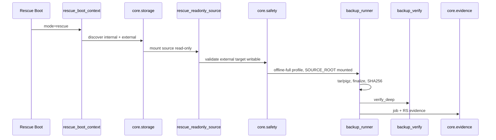

# Rettungsstick — Core-Abhängigkeiten (BR-001-OFFLINE)

**Stand:** 2026-05-20  
**Gate:** BR-001-OFFLINE ist Release-Gate; Live-BR-001 ist experimentell.

---

## Muss Core nutzen (nicht duplizieren)

| Schritt | Core-/Kanon-Modul | Heute |
|--------|-------------------|--------|
| Storage Discovery | **`core.storage_facade`**, `modules/storage_detection`, `core/safe_device` | Deploy-Runner nur Handoff; **kein** eigener lsblk-Parser |
| Mount / RO-Plan | **`core.mount_facade`**, `runner_rescue_readonly_mount_orchestrator` | Plan only — kein mount subprocess im MVP |
| Zielprüfung extern | `safe_device.validate_write_target`, `backup_target_service_access` | API `target-check` in `app.py` |
| Write Guard (Preview) | `safety/write_guard.evaluate_write_target` | `rescue/orchestrator.py` |
| Backup Profile offline-full | `core/backup_profiles.get_backup_profile("offline-full")` | **Implementiert** (Phase C.3); siehe `RESCUE_OFFLINE_FULL_BACKUP_PROFILE_2026-05-20.md` |
| Boot Context | `rescue/boot_context.py` | **Implementiert** (Phase C.1); siehe `RESCUE_BOOT_CONTEXT_2026-05-20.md` |
| Offline Backup Plan | `rescue/backup_orchestrator.py` | **Plan only** (Phase C.2); siehe `RESCUE_OFFLINE_BACKUP_ORCHESTRATOR_2026-05-20.md` |
| Backup Runner | `tools/backup_runner.py` | systemd `setuphelfer-backup@` |
| Manifest + SHA256 | Runner finalize + `modules/backup_engine` | — |
| Verify Deep | `modules/backup_verify.verify_deep` | Runner-Hook |
| Evidence | `tools/backup_evidence_collector`, release-gates JSON | RS-008 |
| Restore Preview | `modules/rescue_restore_dryrun`, `rescue/orchestrator` preview | kein Execute |
| Notifications | `core/notification_service` | optional Failure/Success |

---

## Rescue-spezifisch (neu/erweitern, Orchestration only)

| Modul | Zweck | Status |
|-------|--------|--------|
| `rescue/boot_context.py` | Kontext, Pfade, keine Live-apt | Phase C.1 |
| `rescue/backup_orchestrator.py` | Offline-Plan (kein Start) | Phase C.2 |
| Deploy-Runner Storage/Mount | Handoff über Core-Facades | Phase B |
| `rescue/rescue_restore_preview.py` (Soll) | UI/API Restore-Preview | C.4 |

**Deploy-Runner** bleiben für Lab/Handoff; Produktlogik wandert nicht in Runner.

---

## Darf nicht dupliziert werden

- lsblk/findmnt/blkid-Parser  
- tar/pigz-Kommandozeilen (außer `backup_runner`)  
- SHA256-Berechnung  
- verify_deep Implementierung  
- STORAGE-PROTECTION / SYSTEM-DISK-Heuristiken  
- E-Mail-SMTP-Versand

---

## Offline-BR-001 Ablauf (Soll)

1. Bootstick erkennt `rescue`.  
2. Storage Discovery: interne Quelle + externes Ziel.  
3. Quelle read-only mounten.  
4. Ziel write-guard / target-check.  
5. Offline backup via **ein** Runner + Profil `offline-full`.  
6. Manifest + SHA256.  
7. Verify Deep.  
8. Evidence (RS-006/007, BR-001-OFFLINE JSON).  
9. Restore Preview **separat** (kein Execute im MVP).

---

## Fehlende MVP-Bausteine (kein Core-Duplikat nötig)

- Materialisierte Debian-Live-Config / ISO-Build-Abnahme  
- Offline-UI im Live-System  
- HW-E2E RS-001–RS-008  
- Partitionierungsassistent (Restore Ersatzplatte — **später**, nicht Backup-Blocker)  
- Malware-Scan optional vor Restore (UI-Warnung, kein Backup-Blocker)

---

## Abnahme

Rettungsstick-Implementierung **freigegeben** nach Monolith-Audit, wenn jeder neue PR `NO_DUPLICATE_MODULE_RULES` und `check-module-boundaries.sh` einhält.
